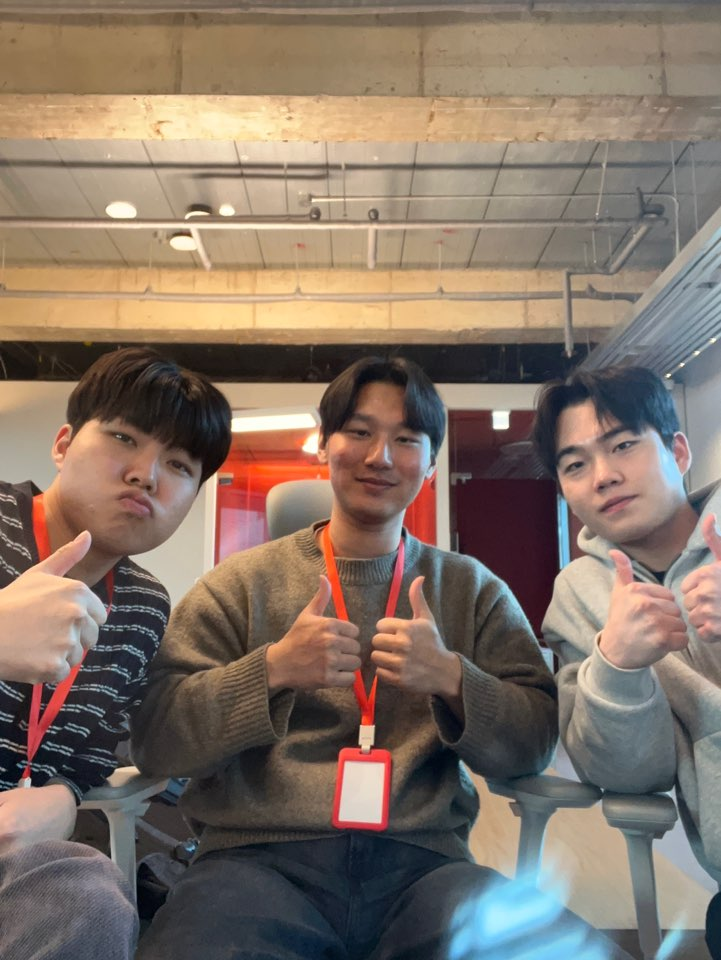

## Team Member

# 🥗 팀 소개: 봄동비빔조
> **애자일하게 비벼드리겠습니다**

---

## 🍱 팀 멤버 구성

### 🍯 김범수

- **학과**: 인공지능전공
- **MBTI**: ENFJ
- **팀 내 역할**: 참기름 | 모든 재료를 유기적으로 결합하는 고농축 인사이트

### 🍚 신채운

- **학과**: 인공지능전공
- **MBTI**: INFP
- **팀 내 역할**: 쌀밥 | 프로젝트의 든든한 탄수화물이자 모든 로직의 베이스

### 🥬 엄주원

- **학과**: 산업공학과
- **MBTI**: ISTJ
- **팀 내 역할**: 봄동 | 시스템의 식감을 결정짓는 날카로운 기술적 시도

---

## 🌶️ 지도 교수님

### 김남주 교수님

- **학과**: 산업공학과
- **MBTI**: ????
- **팀에게 주는 영향**: 
  - 정신이 번쩍 드는 매콤한 피드백과 올바른 방향성 제시
  - 밋밋할 수 있는 우리들에게 '도발적'이라는 매운맛을 주입
