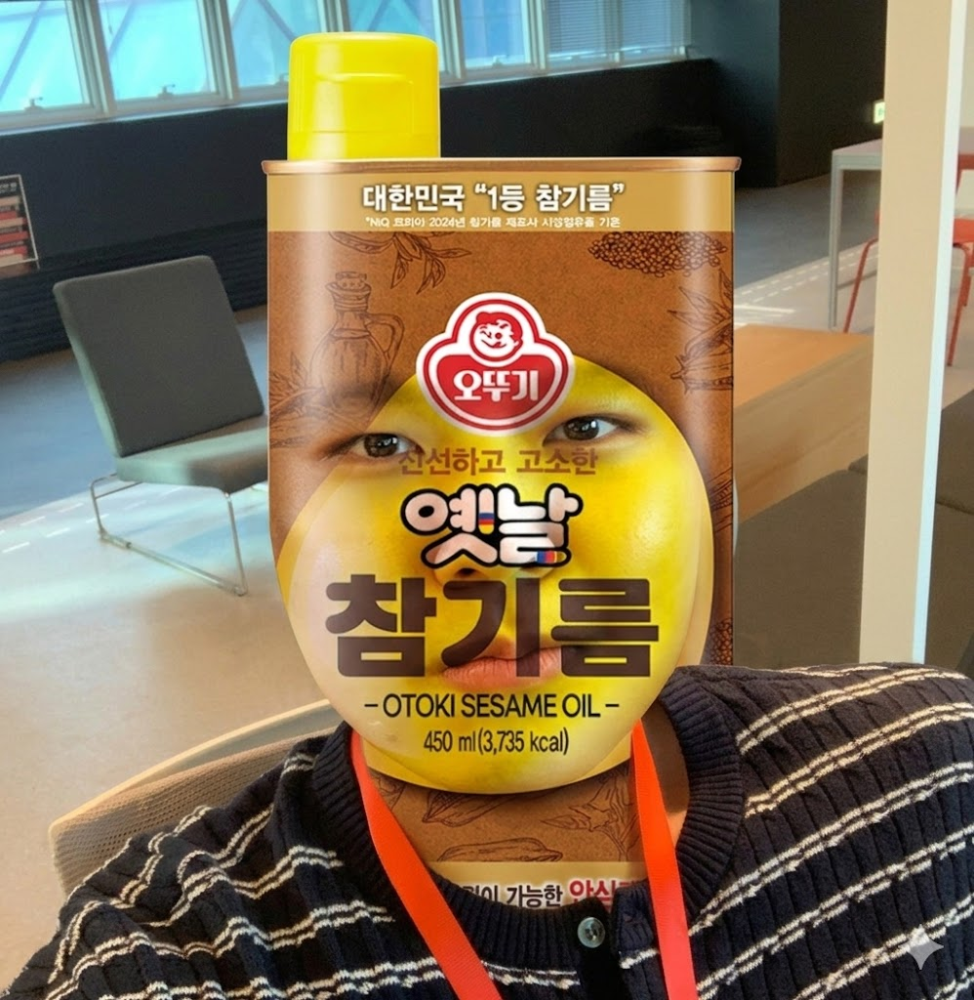
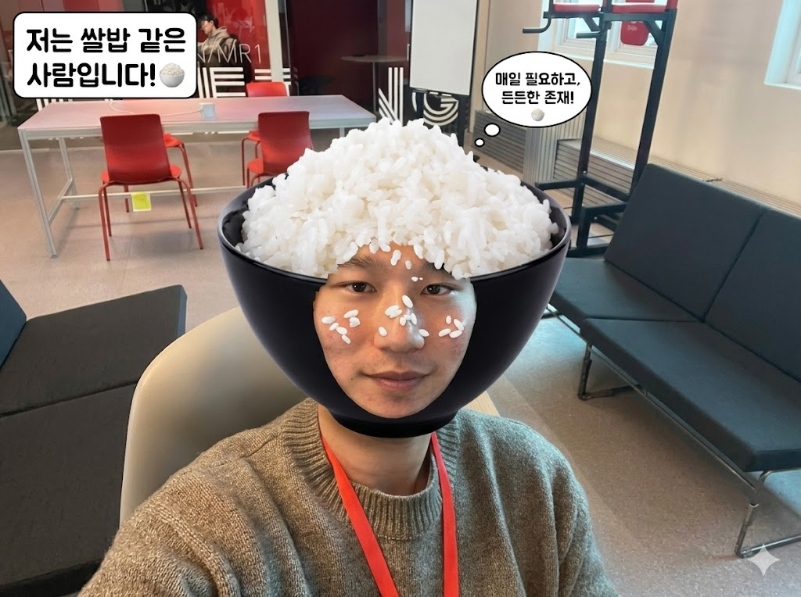
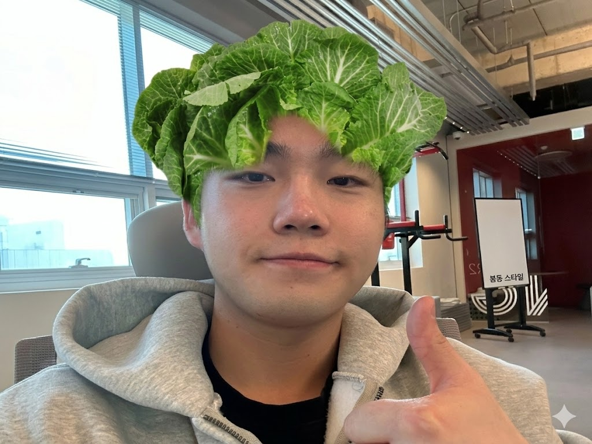
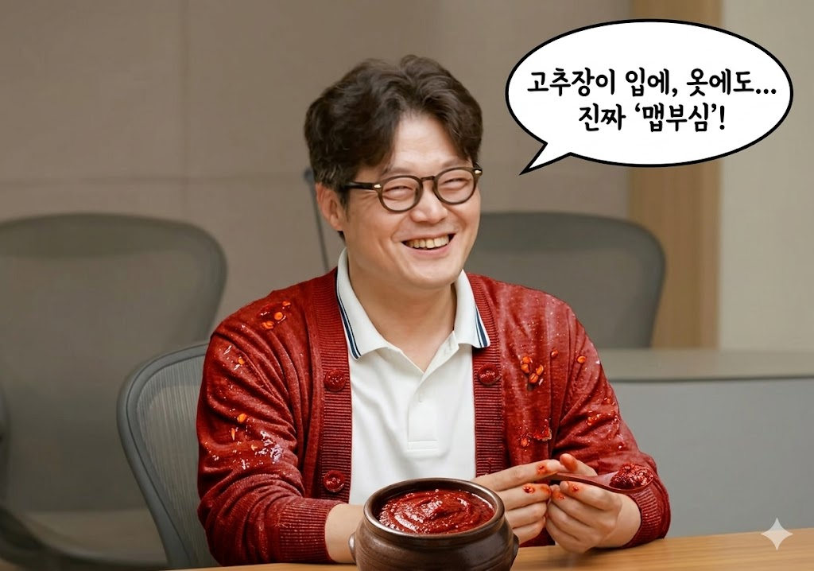
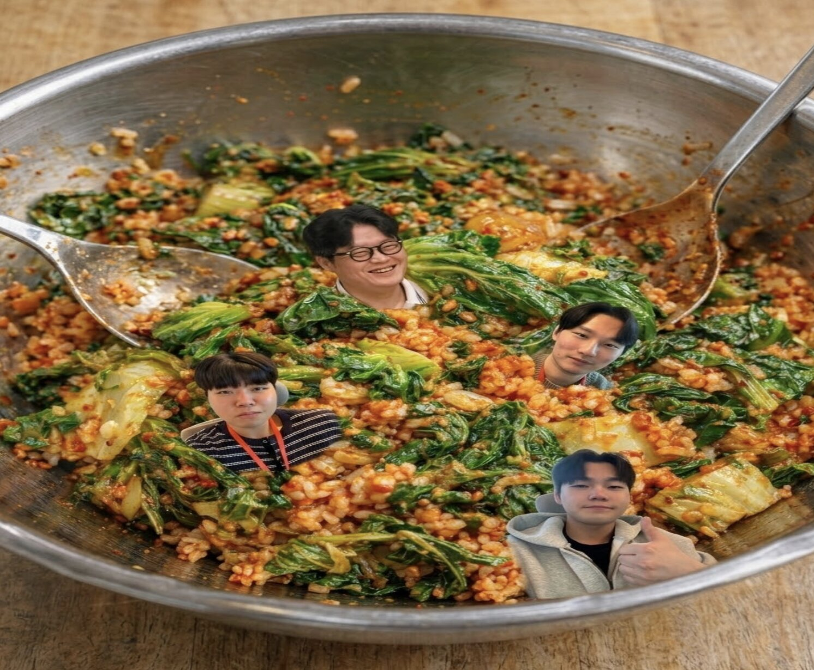

# 🥗 팀 소개: 봄동비빔조
> ### "애자일하게 비벼드리겠습니다"
> 프로젝트의 맛과 영양, 그리고 혁신적인 식감까지 책임지는 팀입니다.

---

## 🍱 팀 멤버 구성

| 구분 | 🍯 김범수 | 🍚 신채운 | 🥬 엄주원 |
| :--- | :--- | :--- | :--- |
| **이미지** |  |  |  |
| **학과** | 인공지능전공 | 인공지능전공 | 산업공학과 |
| **MBTI** | ENFJ | INFP | ISTJ |
| **팀 역할** | 참기름 (인사이트) | 쌀밥 (로직 베이스) | 봄동 (기술적 시도) |

### 💬 각오의 한마디

#### 🍯 김범수
> "방심하지 마세요. 제 인사이트 한 방울이면 프로젝트의 향미가 완전히 달라지니까요."

#### 🍚 신채운
> "제가 없으면 이 프로젝트는 영양가 없는 고추장 범벅일 뿐입니다."

#### 🥬 엄주원
> "시스템이 너무 부드럽기만 하면 재미없죠. 제가 아삭하게 씹어드리겠습니다."

---

## 🌶️ 지도 교수님

### 김남주 교수님

- **학과**: 산업공학과
- **MBTI**: ????
- **핵심 영향력**
    1. 정신이 번쩍 드는 매콤한 피드백과 올바른 방향성 제시
    2. 밋밋할 수 있는 우리들에게 '도발적'이라는 매운맛을 주입

> #### 📢 팀원들에게 해줄 한마디
> "여러분의 평범함에 '도발'이라는 매운맛을 주입해 드리죠."

# 맛있게 비벼질 우리를 기대해주세요!!!

